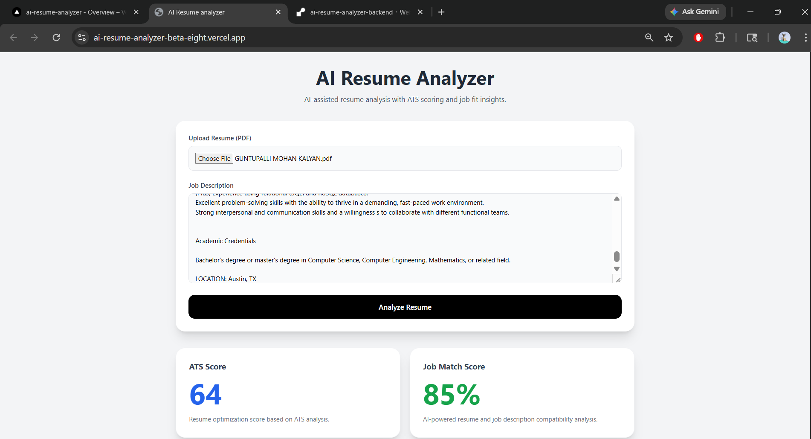
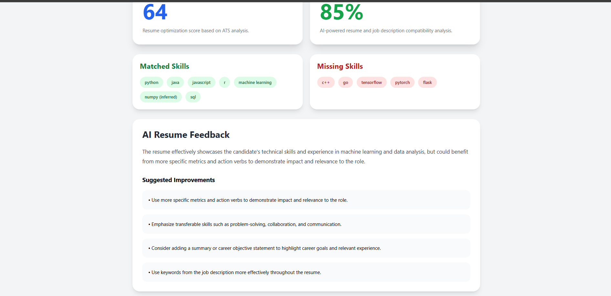
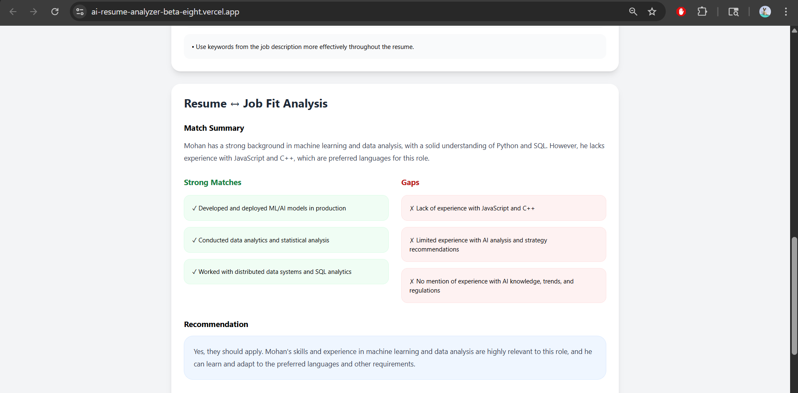

# AI Resume Analyzer

AI-powered Resume Analyzer built using **React + FastAPI + Groq LLM** that helps users evaluate resumes with ATS-style scoring, skill analysis, and AI-generated job fit insights.

---

# Live Demo

## Frontend

[AI Resume Analyzer Live App](https://ai-resume-analyzer-beta-eight.vercel.app)

## Backend API

[FastAPI Backend](https://ai-resume-analyzer-backend-5sk7.onrender.com/docs)

---

# Project Overview

This application allows users to:

* Upload PDF resumes
* Compare resumes against job descriptions
* Generate ATS-style resume scores
* Identify matched and missing skills
* Receive AI-powered resume feedback
* Analyze resume-to-job fit compatibility
* Get recruiter-style improvement suggestions


---

# Features

## ATS Resume Analysis

* Resume parsing using `pdfplumber`
* Skill extraction
* Keyword matching
* ATS score calculation
* Missing skill detection

## AI-Powered Feedback

* Resume improvement suggestions
* Personalized feedback
* Resume optimization tips
* Recruiter-style recommendations

## Resume ↔ Job Fit Analysis


* Job compatibility scoring
* Strong match identification
* Gap analysis
* Tailoring recommendations

## Modern Full-Stack Architecture

* React frontend
* FastAPI backend
* Groq LLM integration
* REST API communication
* Cloud deployment

---

# Tech Stack

| Category       | Technology              |
| -------------- | ----------------------- |
| Frontend       | React, Tailwind CSS     |
| Backend        | FastAPI                 |
| AI Layer       | Groq API (Llama Models) |
| PDF Processing | pdfplumber              |
| Deployment     | Vercel + Render         |

---

# System Architecture

```text
React Frontend
      ↓
FastAPI Backend
      ↓
Resume Processing Engine
      ↓
Groq LLM API
      ↓
AI Analysis & Job Matching
```

---


## Main Dashboard

The application interface allows users to upload resumes and paste job descriptions for analysis.



## ATS Analysis Results

Features:

* ATS Score
* Matched Skills
* Missing Skills
* AI-generated resume feedback



## Resume ↔ Job Fit Analysis

Features:

* Job Match Score
* Match Summary
* Strong Matches
* Skill Gaps
* Tailoring Suggestions



---

# Project Structure

```text
ai-resume-analyzer/
│
├── backend/
│   ├── main.py
│   ├── analyzer.py
│   ├── scoring.py
│   ├── parser.py
│   ├── prompts.py
│   ├── utils.py
│   ├── requirements.txt
│   └── .env
│
├── frontend/
│   ├── src/
│   ├── public/
│   ├── package.json
│   └── vite.config.js
│
└── README.md
```

---

# API Endpoints

## Parse Resume

```http
POST /parse-resume
```

Extracts text and keywords from uploaded PDF resumes.

---

## Analyze Resume

```http
POST /analyze-resume
```

Returns:

* ATS score
* matched skills
* missing skills
* AI resume feedback

---

## Match Job Description

```http
POST /match-jd
```

Returns:

* job fit score
* strengths
* gaps
* recruiter recommendations

---

# Local Setup

## Clone Repository

```bash
git clone <your-repository-url>
cd ai-resume-analyzer
```

---

# Backend Setup

```bash
cd backend

python -m venv venv

# Windows
venv\Scripts\activate

pip install -r requirements.txt
```

Create `.env` file:

```env
GROQ_API_KEY=your_api_key_here
```

Run backend:

```bash
uvicorn main:app --reload
```

Backend runs at:

```text
http://127.0.0.1:8000
```

---

# Frontend Setup

```bash
cd frontend

npm install

npm run dev
```

Frontend runs at:

```text
http://localhost:5173
```

---

# Deployment

| Service  | Platform |
| -------- | -------- |
| Frontend | Vercel   |
| Backend  | Render   |

---

# Learning Outcomes

This project helped strengthen skills in:

* Full-stack AI application development
* FastAPI backend APIs
* React frontend development
* LLM integration
* Prompt engineering
* REST API communication
* Deployment workflows
* AI-powered product architecture

---

# Future Improvements

* Resume history tracking
* User authentication
* Advanced ATS scoring engine
* RAG-based resume optimization
* Vector database integration
* Multi-job comparison
* Interview preparation assistant
* Resume rewrite generation

---

# Why This Project Matters

This project demonstrates:

* Real-world AI product development
* Generative AI integration
* Full-stack engineering
* API-based architecture
* Practical deployment experience
* Recruiter-focused AI workflows

---

# Author

**Mohan Kalyan Guntupalli**

* Machine Learning Enthusiast
* AI/ML-Focused Software Engineer
* Data Science & Generative AI Projects

LinkedIn and GitHub links can be added here.
